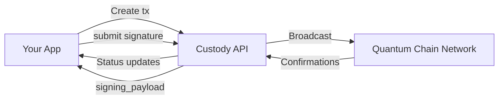
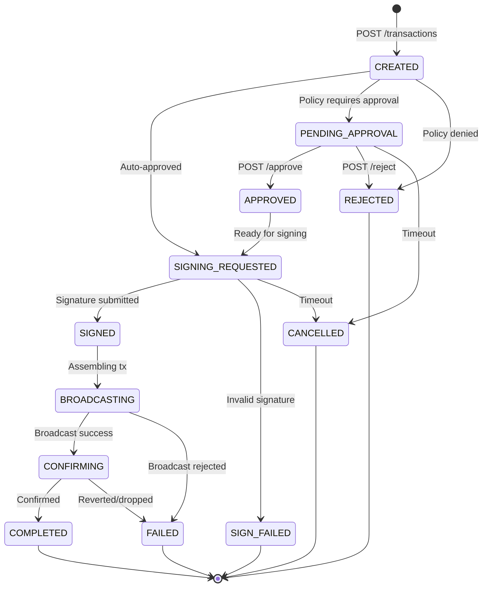

The Quantum Chain Custody API is a **non-custodial** orchestration layer. It manages transaction lifecycle, policy enforcement, and event delivery — but never holds private keys.

## Non-custodial signing model

Unlike traditional custodial solutions, the Custody API delegates all signing to your infrastructure. This means:

- **You control the keys** — Dilithium3 private keys live in your HSM, secure enclave, or key management system
- **The API orchestrates** — it creates transactions, enforces policies, and broadcasts signed transactions to the Quantum Chain network
- **Signing is a callback** — when a transaction needs signing, you retrieve the payload, sign it externally, and submit the signature back

## Transaction lifecycle

Every transaction moves through a deterministic state machine:

| State | Description |
|-------|-------------|
| `CREATED` | Just created, policy evaluation imminent |
| `PENDING_APPROVAL` | Awaiting manual approval per policy |
| `APPROVED` | Approved, transitioning to signing |
| `SIGNING_REQUESTED` | Ready for external Dilithium3 signature |
| `SIGNED` | Signature received and verified |
| `BROADCASTING` | Submitted to Quantum Chain nodes |
| `CONFIRMING` | Included in a block, waiting for confirmation depth |
| `COMPLETED` | Confirmed with sufficient block depth |
| `FAILED` | Transaction reverted or could not be broadcast |
| `REJECTED` | Denied by policy or approver |
| `CANCELLED` | Cancelled before signing or broadcasting |
| `SIGN_FAILED` | Invalid signature submitted |

## Request flow

A typical transfer follows this sequence:

<Steps>
  <Step title="Create transaction">
    Your application calls `POST /v1/transactions` with source, destination, and amount. The API validates the request and runs it through the policy engine.
  </Step>
  <Step title="Policy evaluation">
    Configured policies are evaluated — spending limits, whitelist/blacklist checks, approval requirements, and time windows. If a policy requires approval, the transaction moves to `PENDING_APPROVAL`.
  </Step>
  <Step title="Retrieve signing payload">
    Call `GET /v1/transactions/{id}/signing_payload` to get the unsigned transaction digest as a hex-encoded byte array.
  </Step>
  <Step title="Sign externally">
    Sign the digest with your Dilithium3 private key using your key management solution.
  </Step>
  <Step title="Submit signature">
    Call `POST /v1/transactions/{id}/signature` with the base64-encoded Dilithium3 signature and the signer's public key. The API verifies the signature before accepting it.
  </Step>
  <Step title="Broadcast and confirm">
    The API broadcasts the signed transaction to the Quantum Chain network via the node pool and tracks confirmation depth.
  </Step>
  <Step title="Webhook notification">
    Status change events are delivered to your registered webhook endpoints with HMAC-SHA256 signatures.
  </Step>
</Steps>

## System components

| Component | Role |
|-----------|------|
| **API Server** | HTTP handlers, authentication, rate limiting |
| **Policy Engine** | Pre-broadcast rule evaluation and enforcement |
| **Node Pool** | Manages multiple Quantum Chain RPC connections with failover |
| **Deposit Monitor** | Watches for inbound transfers to registered wallets |
| **Confirmation Tracker** | Monitors block depth for pending transactions |
| **Webhook Dispatcher** | Delivers events with HMAC signing, retry, and dead-letter |
| **Recovery Worker** | Re-processes stuck transactions after restarts |
| **Idempotency Cleanup** | Prunes expired idempotency keys |

## Multi-tenancy

The API supports multiple tenants with full isolation:

- Each tenant has its own API credentials, vaults, wallets, policies, and webhook endpoints
- Cross-tenant access is prevented at the middleware layer
- Tenant context is extracted from the API key and propagated through all service calls

## Dilithium3 signatures

Quantum Chain uses **Dilithium3 / ML-DSA-65**, the NIST post-quantum digital signature standard:

| Property | Value |
|----------|-------|
| Signature size | 3,293 bytes |
| Public key size | 1,952 bytes |
| Security level | NIST Level 3 |
| Digest size | 32 bytes |

The API verifies signatures server-side before broadcasting to ensure only valid transactions reach the network.
