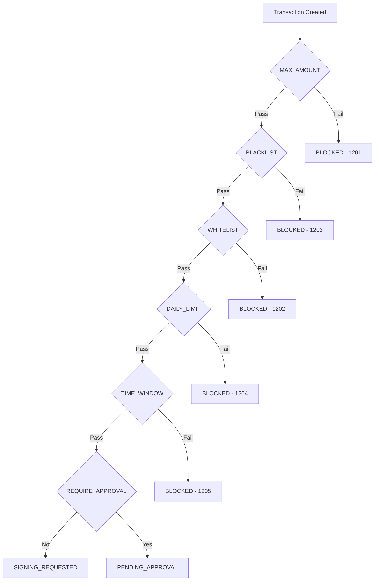

The policy engine evaluates configurable rules before any transaction is broadcast to the Quantum Chain network. Policies provide compliance controls, spending protection, and operational guardrails.

## How policies work

1. You create policy rules on a vault account or tenant
2. When a transaction is created, the policy engine evaluates all applicable rules
3. If any rule is violated, the transaction is blocked or requires approval
4. Only transactions that pass all policies proceed to signing

## Rule types

| Type | Description | Example |
|------|-------------|---------|
| `MAX_AMOUNT` | Blocks transactions above a threshold | Max 100 QC per transfer |
| `DAILY_LIMIT` | Caps total daily outflow | Max 1,000 QC per day |
| `WHITELIST` | Only allows transfers to approved addresses | Known exchange addresses |
| `BLACKLIST` | Blocks transfers to specific addresses | Sanctioned addresses |
| `REQUIRE_APPROVAL` | Requires manual approval before signing | All transfers above 50 QC |
| `TIME_WINDOW` | Restricts transfers to specific hours | Business hours only (UTC) |

## Creating a policy

```bash
curl -X POST "$BASE_URL/policies" \
  -H "Authorization: Bearer $CUSTODY_API_KEY" \
  -H "Content-Type: application/json" \
  -d '{
    "name": "Max transfer limit",
    "vault_account_id": "va_def456",
    "rules": [
      {
        "type": "MAX_AMOUNT",
        "amount": "100.0",
        "asset_id": "QC_NATIVE"
      }
    ]
  }'
```

## Policy evaluation flow



All rules are evaluated. If any rule fails:
- The transaction is **blocked** with an error code in the `1200` range
- If the failing rule is `REQUIRE_APPROVAL`, the transaction enters `PENDING_APPROVAL` instead

## Approval workflow

When a `REQUIRE_APPROVAL` policy triggers:

1. The transaction enters `PENDING_APPROVAL` status
2. A webhook event `transaction.approval_required` is sent
3. An authorized user calls `POST /v1/transactions/{id}/approve` or `POST /v1/transactions/{id}/reject`
4. Approved transactions proceed to `PENDING_SIGNATURE`; rejected transactions move to `REJECTED`

## Error codes

| Code | Meaning |
|------|---------|
| `1200` | Policy violation (general) |
| `1201` | Amount exceeds `MAX_AMOUNT` limit |
| `1202` | Destination not in whitelist |
| `1203` | Destination is blacklisted |
| `1204` | Daily limit exceeded |
| `1205` | Transfer outside allowed time window |

## Best practices

<CardGroup cols={2}>
  <Card title="Defense in depth" icon="layer-group">
    Combine multiple rule types. Use MAX_AMOUNT AND WHITELIST AND DAILY_LIMIT together.
  </Card>
  <Card title="Start permissive" icon="unlock">
    Begin with high limits and tighten as you understand your transaction patterns.
  </Card>
  <Card title="Monitor violations" icon="chart-line">
    Policy violations emit webhook events. Monitor them for suspicious activity.
  </Card>
  <Card title="Separate by vault" icon="boxes-stacked">
    Apply stricter policies to hot wallets and relaxed policies to treasury vaults.
  </Card>
</CardGroup>
