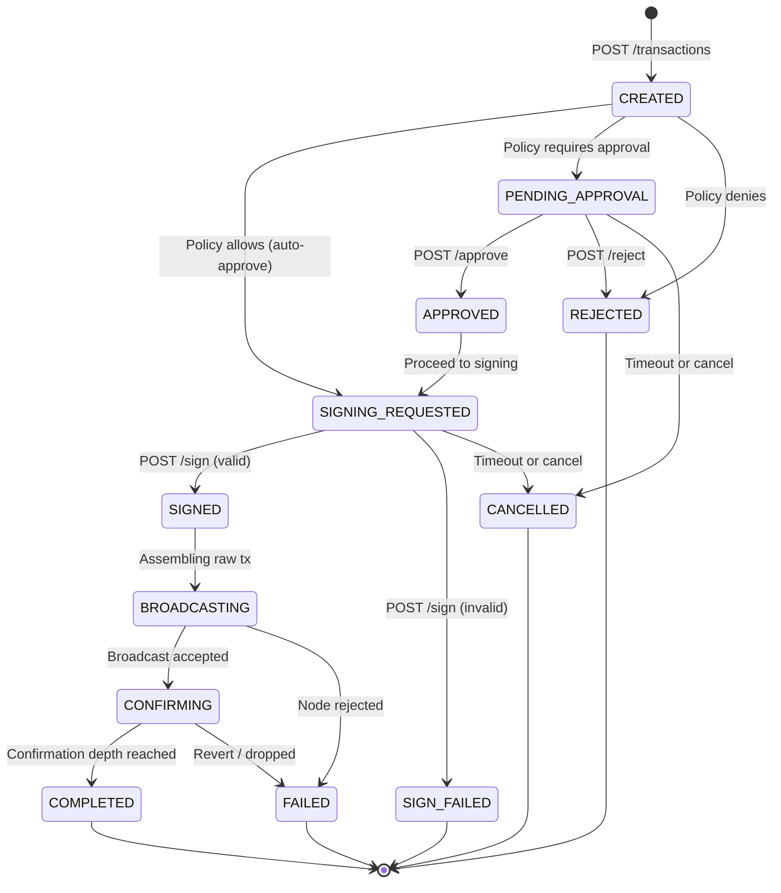
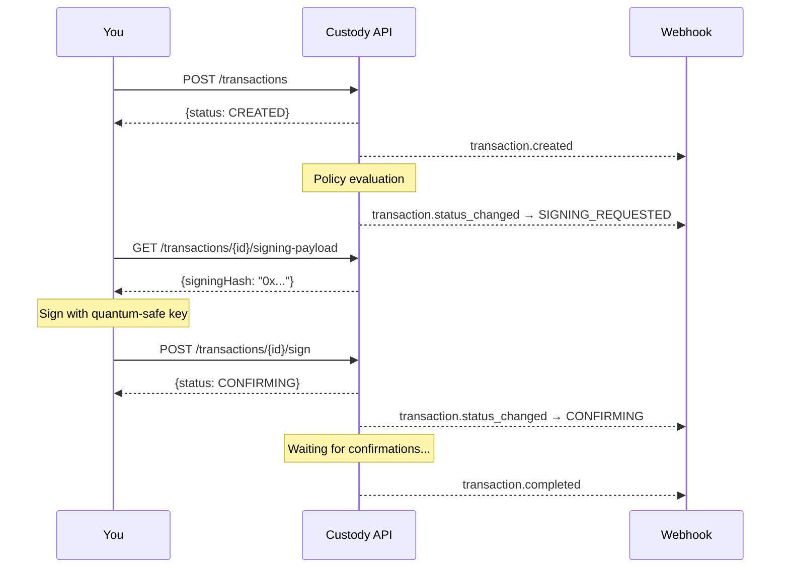

## State diagram

## Transition table

| From | To | Trigger | Actor |
|------|-----|---------|-------|
| — | `CREATED` | `POST /v1/transactions` | API caller |
| `CREATED` | `SIGNING_REQUESTED` | Policy engine approves automatically | System |
| `CREATED` | `PENDING_APPROVAL` | Policy engine requires approval | System |
| `CREATED` | `REJECTED` | Policy engine denies | System |
| `PENDING_APPROVAL` | `APPROVED` | `POST /v1/transactions/{id}/approve` | Approver |
| `PENDING_APPROVAL` | `REJECTED` | `POST /v1/transactions/{id}/reject` | Approver |
| `PENDING_APPROVAL` | `CANCELLED` | Approval timeout or manual cancel | System / API caller |
| `APPROVED` | `SIGNING_REQUESTED` | Automatic after approval | System |
| `SIGNING_REQUESTED` | `SIGNED` | `POST /v1/transactions/{id}/sign` with valid signature | External signer |
| `SIGNING_REQUESTED` | `SIGN_FAILED` | `POST /v1/transactions/{id}/sign` with invalid signature | External signer |
| `SIGNING_REQUESTED` | `CANCELLED` | Signing timeout or manual cancel | System / API caller |
| `SIGNED` | `BROADCASTING` | Transaction assembly complete | System |
| `BROADCASTING` | `CONFIRMING` | Node accepted the transaction | System |
| `BROADCASTING` | `FAILED` | Node rejected (bad nonce, insufficient gas, etc.) | System |
| `CONFIRMING` | `COMPLETED` | Required confirmation depth reached | System |
| `CONFIRMING` | `FAILED` | Transaction reverted or dropped from mempool | System |

## State categories

### Active states (in-progress)

These states indicate the transaction is still being processed:

<CardGroup cols={3}>
  <Card title="CREATED">Just created, policy evaluation imminent</Card>
  <Card title="PENDING_APPROVAL">Waiting for human decision</Card>
  <Card title="APPROVED">Approved, transitioning to signing</Card>
  <Card title="SIGNING_REQUESTED">Awaiting external signature</Card>
  <Card title="SIGNED">Signature validated, assembling tx</Card>
  <Card title="BROADCASTING">Sending to the network</Card>
  <Card title="CONFIRMING">On-chain, counting confirmations</Card>
</CardGroup>

### Terminal states (final)

These states are irreversible. The transaction will not change again:

<CardGroup cols={3}>
  <Card title="COMPLETED">Successfully confirmed on-chain</Card>
  <Card title="FAILED">Failed during broadcast or confirmation</Card>
  <Card title="REJECTED">Denied by policy or approver</Card>
  <Card title="CANCELLED">Cancelled before reaching chain</Card>
  <Card title="SIGN_FAILED">Invalid signature submitted</Card>
</CardGroup>

## Webhook events per state

| State entered | Webhook event |
|---------------|---------------|
| `CREATED` | `transaction.created` |
| `PENDING_APPROVAL` | `approval.required` |
| `APPROVED` | `approval.decision` |
| `REJECTED` | `approval.decision` or `transaction.status_changed` |
| `SIGNING_REQUESTED` | `transaction.status_changed` |
| `SIGNED` | `transaction.status_changed` |
| `BROADCASTING` | `transaction.status_changed` |
| `CONFIRMING` | `transaction.status_changed` |
| `COMPLETED` | `transaction.completed` |
| `FAILED` | `transaction.failed` |
| `CANCELLED` | `transaction.status_changed` |
| `SIGN_FAILED` | `transaction.status_changed` |

## Integration pattern

<Tip>
  Use the `transaction.status_changed` webhook to track all intermediate states,
  and the specific `transaction.completed` / `transaction.failed` events for
  final state handling.
</Tip>
