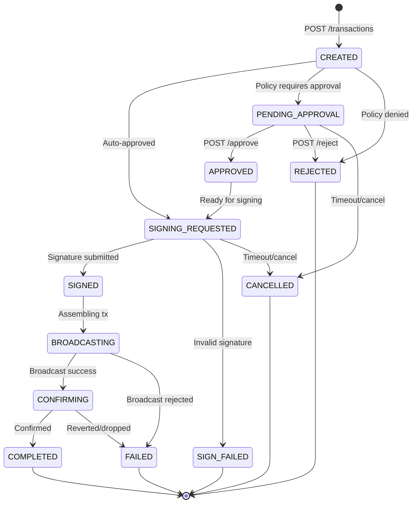

Transactions are the core operation of the Custody API. Every transfer moves through a deterministic state machine from creation to on-chain confirmation.

## Creating a transaction

Submit a transfer with source, destination, amount, and asset:

```bash
curl -X POST "$BASE_URL/transactions" \
  -H "Authorization: Bearer $CUSTODY_API_KEY" \
  -H "Content-Type: application/json" \
  -d '{
    "asset_id": "QC_NATIVE",
    "source": {
      "type": "VAULT_ACCOUNT",
      "id": "va_def456"
    },
    "destination": {
      "type": "ONE_TIME_ADDRESS",
      "one_time_address": {
        "address": "0x5678...efgh"
      }
    },
    "amount": "10.0",
    "note": "Payment"
  }'
```

### Source and destination types

| Type | Description |
|------|-------------|
| `VAULT_ACCOUNT` | A vault account managed by the Custody API |
| `ONE_TIME_ADDRESS` | An external address used for a single transfer |

## State machine



### States

| State | Description | Duration |
|-------|-------------|----------|
| `CREATED` | Just created, policy evaluation imminent | Instant |
| `PENDING_APPROVAL` | Awaiting manual approval per policy | Until approved/rejected |
| `APPROVED` | Approved, transitioning to signing | Instant |
| `SIGNING_REQUESTED` | Awaiting external Dilithium3 signature | Until you sign |
| `SIGNED` | Signature received and verified | Seconds |
| `BROADCASTING` | Submitted to Quantum Chain nodes | Seconds |
| `CONFIRMING` | In a block, waiting for confirmation depth | ~15–60 seconds |
| `COMPLETED` | Confirmed with sufficient block depth | Final |
| `FAILED` | Reverted or broadcast failure | Final |
| `REJECTED` | Denied by policy or approver | Final |
| `CANCELLED` | Cancelled before broadcast | Final |
| `SIGN_FAILED` | Invalid signature submitted | Final |

## Signing flow

<Steps>
  <Step title="Get the signing payload">
    ```bash
    curl "$BASE_URL/transactions/{id}/signing_payload" \
      -H "Authorization: Bearer $CUSTODY_API_KEY"
    ```

    Returns a hex-encoded byte array representing the unsigned transaction digest.
  </Step>
  <Step title="Sign with Dilithium3">
    Use your external key management system to produce a Dilithium3 signature over the digest bytes.
  </Step>
  <Step title="Submit the signature">
    ```bash
    curl -X POST "$BASE_URL/transactions/{id}/signature" \
      -H "Authorization: Bearer $CUSTODY_API_KEY" \
      -H "Content-Type: application/json" \
      -d '{
        "signature": "<base64-dilithium3-signature>",
        "signer_public_key": "<base64-public-key>"
      }'
    ```

    The API verifies the signature against the registered wallet's public key before accepting it.
  </Step>
</Steps>

## Approval and rejection

If a policy requires manual approval, the transaction enters a `PENDING_APPROVAL` state.

```bash
# Approve
curl -X POST "$BASE_URL/transactions/{id}/approve" \
  -H "Authorization: Bearer $CUSTODY_API_KEY"

# Reject
curl -X POST "$BASE_URL/transactions/{id}/reject" \
  -H "Authorization: Bearer $CUSTODY_API_KEY"
```

## Cancellation

Cancel a transaction before it has been broadcast:

```bash
curl -X POST "$BASE_URL/transactions/{id}/cancel" \
  -H "Authorization: Bearer $CUSTODY_API_KEY"
```

<Warning>
You can only cancel transactions in `PENDING_SIGNATURE` or `PENDING_APPROVAL` states. Transactions that have been signed and broadcast cannot be cancelled.
</Warning>

## Idempotency

Include an `Idempotency-Key` header to safely retry requests without creating duplicate transactions:

```bash
curl -X POST "$BASE_URL/transactions" \
  -H "Authorization: Bearer $CUSTODY_API_KEY" \
  -H "Idempotency-Key: unique-request-id-123" \
  -H "Content-Type: application/json" \
  -d '{...}'
```

Idempotency keys expire after 24 hours.

## Listing and filtering

```bash
# List all transactions
curl "$BASE_URL/transactions" \
  -H "Authorization: Bearer $CUSTODY_API_KEY"

# Get a specific transaction
curl "$BASE_URL/transactions/{id}" \
  -H "Authorization: Bearer $CUSTODY_API_KEY"
```
