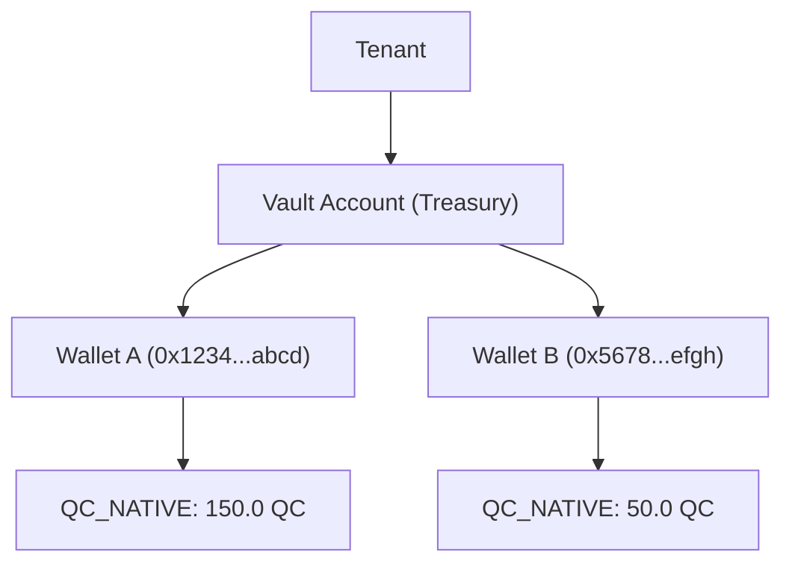

The Custody API uses a two-level hierarchy to organize blockchain addresses: **vault accounts** contain **wallets**, and wallets hold assets on the Quantum Chain network.

## Vault accounts

A vault account is a logical container that groups related wallets. Common patterns:

- **By purpose:** "Treasury", "Operations", "Cold Storage"
- **By department:** "Engineering", "Finance", "Trading"
- **By client:** one vault per end customer in a platform model

### Create a vault account

```bash
curl -X POST "$BASE_URL/vault/accounts" \
  -H "Authorization: Bearer $CUSTODY_API_KEY" \
  -H "Content-Type: application/json" \
  -d '{"name": "Treasury", "tenant_id": "tnt_abc123"}'
```

### List vault accounts

```bash
curl "$BASE_URL/vault/accounts" \
  -H "Authorization: Bearer $CUSTODY_API_KEY"
```

## Wallets

A wallet represents a single Quantum Chain address within a vault account. Each wallet has:

- **Address:** the Quantum Chain hex address
- **Public key:** the post-quantum public key associated with the address
- **Name:** an optional human-readable label

### Non-custodial registration

Since the Custody API is non-custodial, you **register** existing wallets rather than having the API generate keys. You provide the address, post-quantum public key, and an **ownership proof** from your external key management system.

#### Ownership proof

To prevent registering wallets you do not control, every registration request must include a signature over a deterministic challenge:

1. Compute the challenge: `Keccak256("qustody:register:" + lowercase_address)`
2. Sign the 32-byte challenge with your post-quantum private key
3. Include the hex-encoded signature in the `signature` field

The API verifies that the public key derives to the given address and that the signature is valid.

```bash
curl -X POST "$BASE_URL/vault/accounts/{vaultAccountId}/wallets" \
  -H "Authorization: Bearer $CUSTODY_API_KEY" \
  -H "Content-Type: application/json" \
  -d '{
    "address": "0x1234...abcd",
    "publicKey": "<hex-encoded-public-key>",
    "signature": "<hex-encoded-ownership-signature>",
    "label": "Hot Wallet"
  }'
```

### Query wallet balance

```bash
curl "$BASE_URL/wallets/{walletId}/balance" \
  -H "Authorization: Bearer $CUSTODY_API_KEY"
```

## Assets

Assets represent token types held in wallets. The Quantum Chain native token is `QC_NATIVE`.

### Vault-level asset summary

Get aggregated balances across all wallets in a vault:

```bash
curl "$BASE_URL/vault/accounts/{vaultAccountId}/assets" \
  -H "Authorization: Bearer $CUSTODY_API_KEY"
```

### Global asset catalog

List all supported assets:

```bash
curl "$BASE_URL/assets" \
  -H "Authorization: Bearer $CUSTODY_API_KEY"
```

## Hierarchy diagram



<Info>
Each wallet belongs to exactly one vault account. A vault account belongs to exactly one tenant. Cross-tenant access is not permitted.
</Info>
