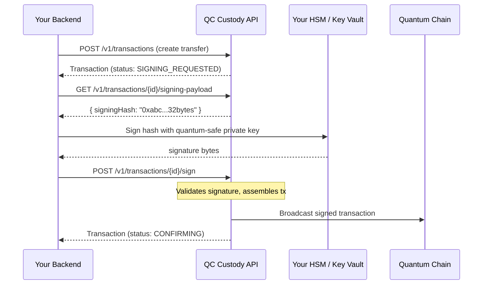

## Overview

QC Custody keeps your private keys outside the custody service. The service prepares unsigned transactions, and you sign them in your own secure environment using **quantum-safe** cryptography.

This is the most critical integration point. Get this right, and everything else flows automatically.

## The signing flow



## Step-by-step

### 1. Create a transfer

<CodeGroup>
```python Python SDK
from quantumchain_custody import Client

client = Client(api_key="ck_live_abc123:sk_live_xyz789")

tx = client.transactions.create(
    source_wallet_id="wallet-uuid",
    destination_addr="0x742d35Cc6634C0532925a3b844Bc9e7595f2bD68",
    asset_id="asset-uuid",
    amount="1000000000000000000",
    note="Payment to vendor",
    idempotency_key="transfer-001"
)
print(f"Transaction ID: {tx.id}, Status: {tx.status}")
```

```bash cURL
curl -X POST https://api.quantumchain.io/v1/transactions \
  -H "Content-Type: application/json" \
  -H "Authorization: Bearer $API_KEY" \
  -H "Idempotency-Key: transfer-001" \
  -d '{
    "sourceWalletId": "wallet-uuid",
    "destinationAddr": "0x742d35Cc6634C0532925a3b844Bc9e7595f2bD68",
    "assetId": "asset-uuid",
    "amount": "1000000000000000000",
    "note": "Payment to vendor"
  }'
```
</CodeGroup>

If no policies block it, the transaction moves to `SIGNING_REQUESTED`.

### 2. Retrieve the signing payload

<CodeGroup>
```python Python SDK
payload = client.transactions.get_signing_payload(tx.id)
print(f"Signing hash: {payload.signing_hash}")
```

```bash cURL
curl https://api.quantumchain.io/v1/transactions/{tx-id}/signing-payload \
  -H "Authorization: Bearer $API_KEY"
```
</CodeGroup>

```json Response
{
  "transactionId": "tx-uuid",
  "signingHash": "0x4e03657aea45a94fc7d47ba826c8d667c0d1e6e33a64a036ec44f58fa12d6c45",
  "status": "SIGNING_REQUESTED",
  "sourceAddress": "0xYourWalletAddress",
  "destinationAddress": "0x742d35Cc6634C0532925a3b844Bc9e7595f2bD68",
  "amount": "1000000000000000000",
  "assetId": "asset-uuid"
}
```

The `signingHash` is a **32-byte Keccak256 digest** (hex-encoded as a 66-character string including `0x` prefix). This is what you sign.

### 3. Sign with your quantum-safe key

Sign the hash bytes using your quantum-safe private key in your secure environment (HSM, KMS, or key vault).

The signing operation takes the 32-byte hash digest as input and produces a post-quantum signature. Use the SDK or tooling provided during onboarding for your specific key management setup.

<CodeGroup>
```python Python SDK
# After signing the hash in your secure environment:
# signature_hex, public_key_hex = your_signing_function(payload.signing_hash)

result = client.transactions.submit_signature(
    tx.id,
    signature=signature_hex,
    public_key=public_key_hex
)
print(f"Status: {result.status}, TX Hash: {result.chain_tx_hash}")
```

```bash cURL
curl -X POST https://api.quantumchain.io/v1/transactions/{tx-id}/sign \
  -H "Content-Type: application/json" \
  -H "Authorization: Bearer $API_KEY" \
  -d '{
    "signature": "<hex-encoded-signature>",
    "publicKey": "<hex-encoded-public-key>"
  }'
```
</CodeGroup>

```json Success Response
{
  "id": "tx-uuid",
  "status": "CONFIRMING",
  "chainTxHash": "0x7f9e4c2a3b1d8e5f6c0a9b8d7e6f5a4b3c2d1e0f...",
  "broadcastAt": "2026-03-17T10:01:23Z"
}
```

After submission, the service:

1. **Validates** the quantum-safe signature against the signing hash
2. **Verifies** the public key matches the registered wallet
3. **Assembles** the signed transaction
4. **Broadcasts** to the Quantum Chain network
5. **Tracks** confirmations until the required depth is reached

## What happens on failure

| Scenario | Response | Next step |
|----------|----------|-----------|
| Wrong signature | `400 Bad Request`, signature verification failed | Re-sign with correct key |
| Wrong public key | `400 Bad Request`, public key mismatch | Use the public key registered with the wallet |
| Wrong state | `409 Conflict`, transaction not in SIGNING_REQUESTED | Check current status; may already be signed |
| Network error on broadcast | Transaction moves to `FAILED` | Create a new transaction (new nonce assigned) |
| Signing timeout | Transaction moves to `CANCELLED` | Create a new transaction |

## Security considerations

<AccordionGroup>
  <Accordion title="Never expose private keys to the network">
    Signing should happen in an air-gapped HSM, AWS KMS, Azure Key Vault, or
    similar isolated environment. The signing hash is all that leaves the
    custody service.
  </Accordion>
  <Accordion title="Verify the signing hash independently">
    Before signing, your backend can independently reconstruct the expected
    transaction hash from the parameters (destination, amount, nonce, gas) to
    verify the custody service hasn't been tampered with.
  </Accordion>
  <Accordion title="Use webhooks for async signing">
    For high-throughput systems, don't block on signing. Instead:

    1. Create the transfer
    2. Listen for the `transaction.status_changed` webhook (status = SIGNING_REQUESTED)
    3. Fetch the signing payload
    4. Sign and submit asynchronously
  </Accordion>
  <Accordion title="Wallet ownership proof">
    When you register a wallet, the API requires a signature proving you
    control the private key. The challenge is deterministic:
    `Keccak256("qustody:register:" + lowercase_address)`. Sign this 32-byte
    digest with your quantum-safe key and include the hex-encoded signature
    in the registration request. See [Vaults and wallets](/concepts/vaults-wallets)
    for the full flow.
  </Accordion>
</AccordionGroup>
