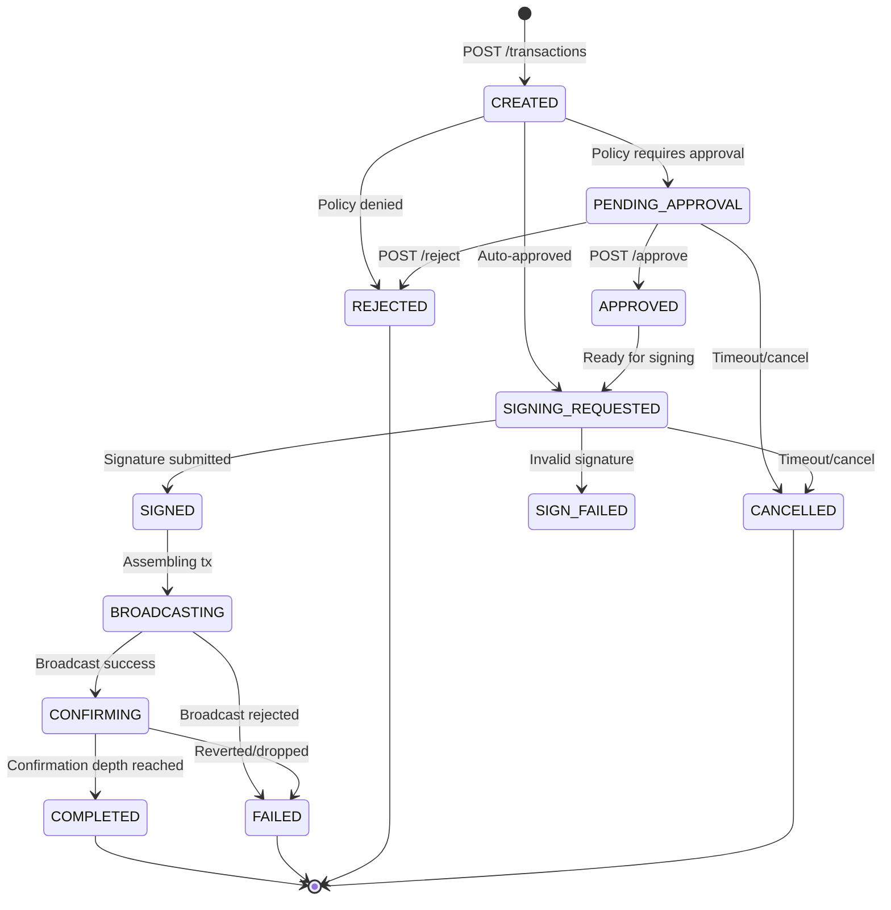

## Overview

Every transfer in QC Custody follows a deterministic state machine. Understanding these states is critical for reliable integrations. Your system should handle each transition and respond to webhook events accordingly.

## State machine diagram



## States explained

### Active states

<AccordionGroup>
  <Accordion title="CREATED" icon="circle-plus">
    Transaction has been created and validated. The service has estimated gas and assigned a nonce. Policy evaluation happens immediately, and the transaction automatically transitions to `SIGNING_REQUESTED`, `PENDING_APPROVAL`, or `REJECTED`.
  </Accordion>

  <Accordion title="PENDING_APPROVAL" icon="clock">
    A policy rule (e.g., `REQUIRE_APPROVAL`) has flagged this transaction. It remains here until an authorized user calls `POST /transactions/{id}/approve` or `POST /transactions/{id}/reject`.

    **Webhook event:** `approval.required`
  </Accordion>

  <Accordion title="APPROVED" icon="circle-check">
    An approver has approved the transaction. It immediately transitions to `SIGNING_REQUESTED`.

    **Webhook event:** `approval.decision`
  </Accordion>

  <Accordion title="SIGNING_REQUESTED" icon="pen-nib">
    The transaction is ready for external signing. Call `GET /transactions/{id}/signing-payload` to retrieve the Keccak256 hash, sign it with your quantum-safe private key, and submit via `POST /transactions/{id}/sign`.

    **Webhook event:** `transaction.status_changed`

    This is the **key integration point**. See the [External signing guide](/guides/external-signing).
  </Accordion>

  <Accordion title="SIGNED" icon="signature">
    The signature has been validated. The service is assembling the raw signed transaction.
  </Accordion>

  <Accordion title="BROADCASTING" icon="tower-broadcast">
    The signed transaction is being sent to the Quantum Chain network via RPC.
  </Accordion>

  <Accordion title="CONFIRMING" icon="spinner">
    The transaction has been broadcast and is awaiting on-chain confirmation. The service polls for the transaction receipt and tracks the confirmation depth.
  </Accordion>
</AccordionGroup>

### Terminal states

<AccordionGroup>
  <Accordion title="COMPLETED" icon="circle-check">
    The transaction has reached the required confirmation depth. The `chainTxHash`, `blockNumber`, and `confirmedAt` fields are populated.

    **Webhook event:** `transaction.completed`
  </Accordion>

  <Accordion title="REJECTED" icon="ban">
    A policy denied the transaction (e.g., amount exceeds limit, destination blacklisted) or an approver explicitly rejected it. Check `failureReason` for details.
  </Accordion>

  <Accordion title="FAILED" icon="triangle-exclamation">
    The transaction failed during broadcast (node rejected it) or during confirmation (reverted on-chain, dropped from mempool). Check `failureReason`.

    **Webhook event:** `transaction.failed`
  </Accordion>

  <Accordion title="CANCELLED" icon="xmark">
    The transaction was cancelled by the integrator or by timeout before reaching a final on-chain state.
  </Accordion>

  <Accordion title="SIGN_FAILED" icon="key">
    The submitted signature was invalid: wrong key, corrupted signature, or public key mismatch.
  </Accordion>
</AccordionGroup>

## Happy path timeline

Here's what a typical successful transfer looks like:

| Step | State | Who | Duration |
|------|-------|-----|----------|
| 1 | `CREATED` | API caller | Instant |
| 2 | `SIGNING_REQUESTED` | Auto (policy engine) | < 100ms |
| 3 | `SIGNED` | External signer | Depends on your infra |
| 4 | `BROADCASTING` | Custody service | < 1s |
| 5 | `CONFIRMING` | Custody service | Network block time |
| 6 | `COMPLETED` | Custody service | Confirmation depth reached |

## Polling vs. webhooks

You can track transaction status two ways:

<CardGroup cols={2}>
  <Card title="Polling" icon="arrows-rotate">
    Call `GET /transactions/{id}` periodically. Simple but adds latency and load.

    ```bash
    curl https://api.quantumchain.io/v1/transactions/{id} \
      -H "Authorization: Bearer $API_KEY"
    ```
  </Card>
  <Card title="Webhooks (recommended)" icon="bell">
    Register a webhook endpoint and receive real-time events at every state transition.

    See the [Webhooks guide](/concepts/webhooks).
  </Card>
</CardGroup>

## Filtering transactions

List transactions with filters for monitoring:

```bash
# All confirming transactions
curl "https://api.quantumchain.io/v1/transactions?status=CONFIRMING" \
  -H "Authorization: Bearer $API_KEY"

# All transactions for a specific vault
curl "https://api.quantumchain.io/v1/transactions?vaultId=vault-uuid" \
  -H "Authorization: Bearer $API_KEY"

# All transactions for a specific wallet and asset
curl "https://api.quantumchain.io/v1/transactions?walletId=wallet-uuid&assetId=asset-uuid" \
  -H "Authorization: Bearer $API_KEY"
```

## Error handling

<Warning>
  Always check `failureReason` on terminal states (`FAILED`, `REJECTED`,
  `SIGN_FAILED`, `CANCELLED`). It contains a human-readable explanation of what
  went wrong.
</Warning>

Common failure reasons:

| Reason | State | Resolution |
|--------|-------|------------|
| `amount exceeds max` | REJECTED | Lower the amount or adjust the MAX_AMOUNT policy |
| `destination is blacklisted` | REJECTED | Remove the address from the blacklist policy |
| `nonce too low` | FAILED | The nonce was already used. Retry creates a new nonce |
| `insufficient funds` | FAILED | Fund the source wallet with enough QC for amount + gas |
| `signature verification failed` | SIGN_FAILED | Verify you're signing the correct hash with the correct key |
